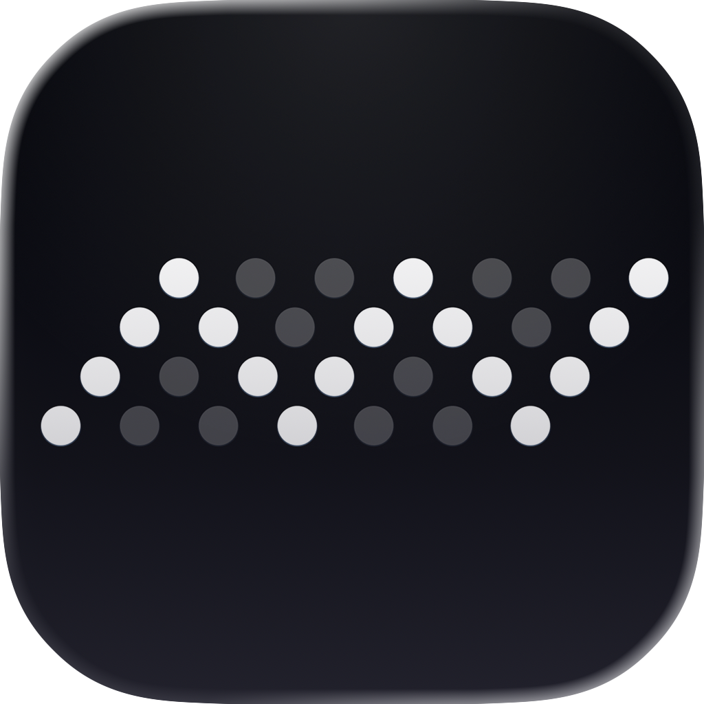

  

<h1 align="center">AVE</h1>

  <strong>A local-first AI video editor for macOS.</strong> 
  Import footage, find the right moments, preview the edit plan, approve real timeline changes and export locally.

  <a href="https://aivideoeditor.app/download/"><strong>Download AVE</strong></a> ·
  <a href="https://aivideoeditor.app">Website</a> ·
  <a href="https://aivideoeditor.app/release-notes/">Release notes</a> ·
  <a href="mailto:support@tinythings.app">Support</a>

  
  
  
  

---

AVE combines a real non-linear editor with project-aware AI. The editor stays in control: AI can search and reason over your project, but timeline changes run through visible AVE editing tools you can inspect and refine.

## Latest release — AVE 1.0.20

AVE 1.0.20 makes hands-on editing faster and release recovery safer:

- Resize selected graphics directly from canvas corners and edges, with centered resizing and safe-area snapping.
- Move and trim timeline clips with smart snapping; hold **Option** before or during the gesture to bypass it temporarily.
- Use one shared color workflow across graphics, captions and chroma key, including validated hex values and the macOS eyedropper.
- Start available app updates from the status bar and follow clearer download progress.
- Recover interrupted media imports more safely when macOS remounts an external volume.

  <a href="https://aivideoeditor.app/download/"><strong>Download AVE 1.0.20 for Mac →</strong></a>

## Built for real editing

- **Editable timeline** — trim, split, ripple, move, duplicate, retime and close gaps across video, audio, captions and graphics.
- **Project-aware Ask and Plan** — search footage, answer project questions, apply supported direct actions or preview a multi-step edit before it changes the sequence.
- **Local asset intelligence** — analyze visual content and speech, search by intent, find useful moments and preview source results before using them.
- **Graphics and captions** — build titles, lower thirds, layered graphics, standard or karaoke captions, transitions and motion with preview-to-export consistency.
- **Native rendering** — refine the result by hand, run export preflight and render finished video locally from the Mac app.
- **Flexible AI setup** — use the bundled Local AI engine, an installed CLI assistant or an OpenAI-compatible provider you choose.

## From footage to finished cut

| Step | What happens |
| --- | --- |
| **1. Import** | Bring in video, audio and graphics. AVE builds useful project context from metadata, transcripts, visual notes and the active sequence. |
| **2. Ask or Plan** | Ask for direction, source search and smaller edits, or preview a structured multi-step edit plan. |
| **3. Approve and edit** | Approved work becomes visible native timeline changes—not an opaque generated video. |
| **4. Refine and export** | Adjust clips, transitions, captions, graphics, audio and framing by hand, then render locally. |

## Local by default

Project files, imported footage, local analysis, timeline execution and exports stay on your Mac by default. AVE includes its Local AI engine, Local Vision Lite, Fast Captions and starter models in the complete app package.

External assistants and API providers are optional. If you connect one, AVE sends compact task context for the work you request; native timeline changes still run through AVE's validated editor controls.

## Download and install

1. Download the latest DMG from [aivideoeditor.app/download](https://aivideoeditor.app/download/).
2. Open the DMG and drag AVE into Applications.
3. Launch AVE and create or open a local project.

AVE requires **macOS 14 or later** on an **Apple Silicon Mac, M1 or later**. The complete download is approximately **1.23 GB** because the Local AI runtime and starter analysis models are included.

## Release files

This is AVE's **only active release repository**. Each release contains:

| File | Used for |
| --- | --- |
| `AVE-<version>-mac-arm64.dmg` | Signed and notarized manual installation. |
| `AVE-<version>-mac-arm64.zip` | Signed complete package used by the in-app Sparkle updater. |
| `AVE-<version>-mac-arm64.md` | Release notes displayed by the updater. |
| `appcast.xml` | Signed Sparkle update metadata. |

The DMG is the right file for a new installation. AVE handles the ZIP and appcast automatically when installing an in-app update.

## Updates and legacy compatibility

AVE 1.0.17 build 19 and later update directly through this repository's signed Sparkle feed. Projects, settings, accounts, downloaded models and linked model folders remain in place across the update.

AVE 1.0.15 and 1.0.16 first receive a compact compatibility bridge from the frozen [legacy update repository](https://github.com/lemberalla/ave-releases), then continue here. The legacy repository is not a current AVE download source.

## Support

This repository is distribution-only, so GitHub Issues are disabled. Use **Send Feedback** inside AVE or email [support@tinythings.app](mailto:support@tinythings.app) for help.

---

  Made by Oncel Cebeci · <a href="https://tinythings.app">a TinyThings app</a>

